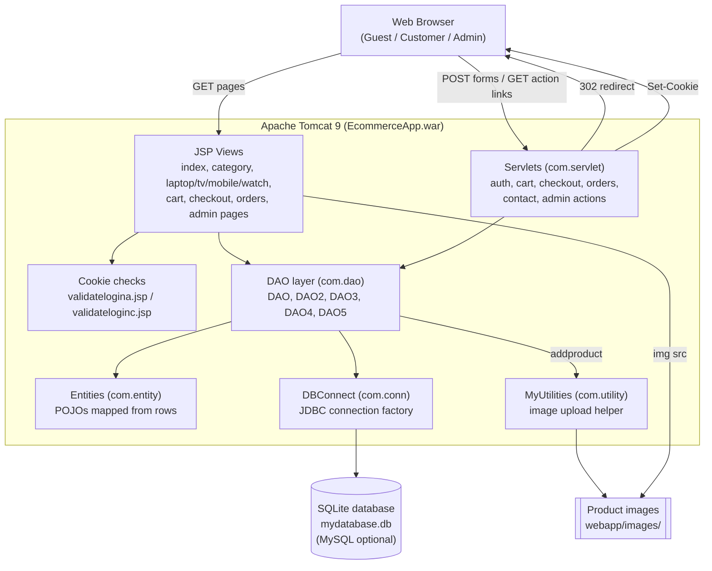
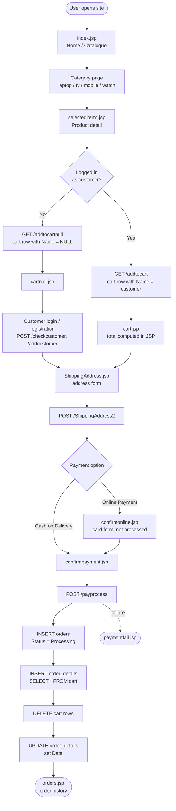
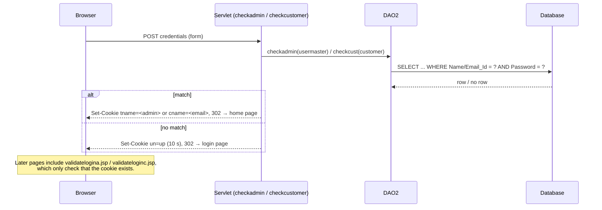
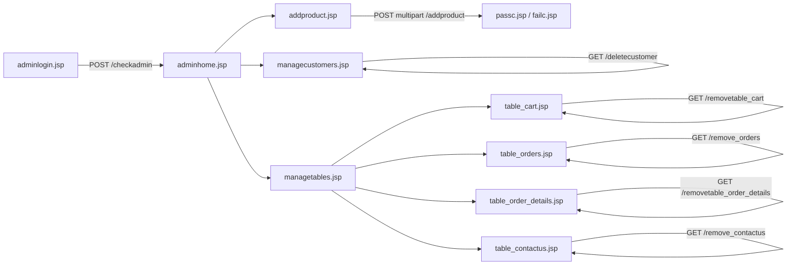
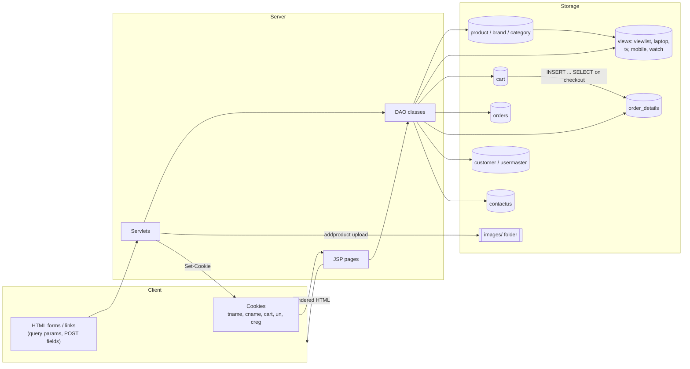
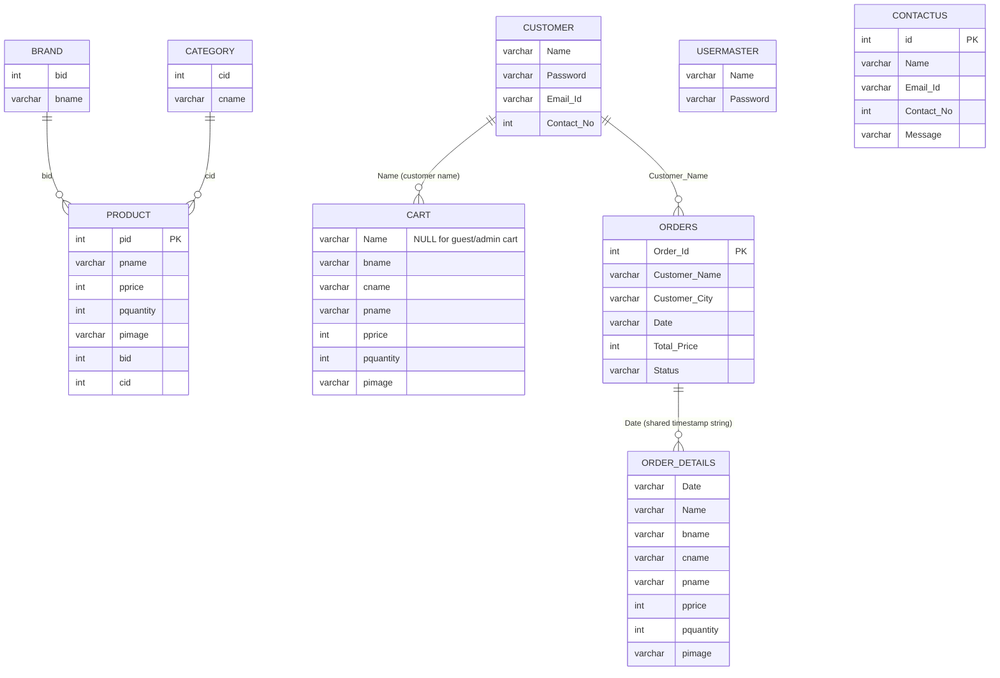
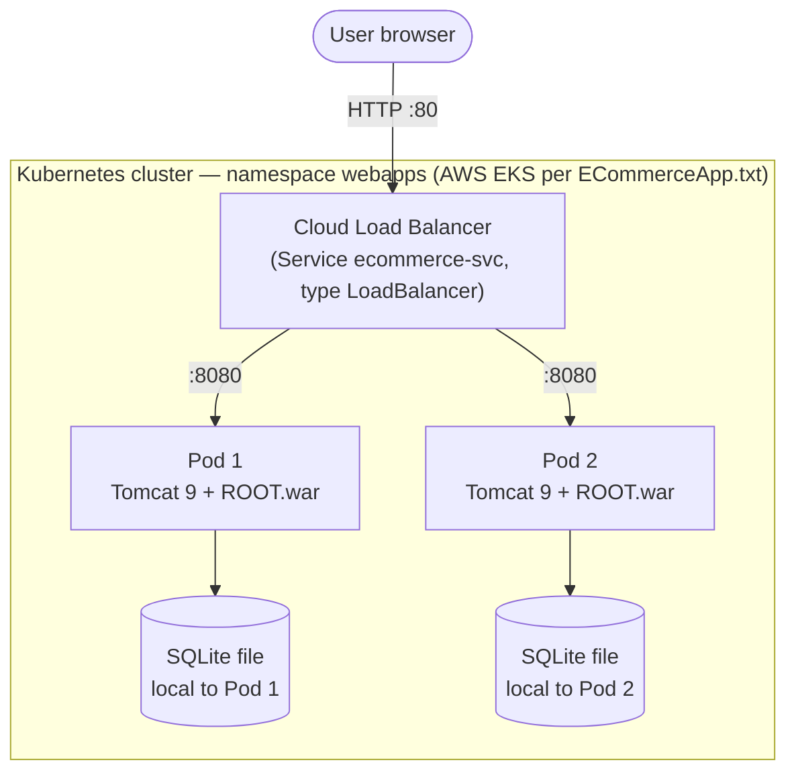

# Online Electronic Shopping — Java Servlet/JSP E-Commerce Web Application

A server-rendered e-commerce web application for browsing and ordering consumer electronics (laptops, TVs, mobiles, and watches). It is built with Java Servlets and JSP, packaged as a WAR with Maven, runs on Apache Tomcat 9, and stores its data in an embedded SQLite database (MySQL is supported as an alternative). The repository also contains a multi-stage Dockerfile, a Kubernetes Deployment/Service manifest, and a written guide for a Jenkins-based CI/CD pipeline that targets AWS EKS.

The application provides three user experiences:

- **Guests** can browse the catalogue, use a cart, register, and send a contact message.
- **Customers** can log in, manage a personal cart, check out with a shipping address, choose a payment option, and view or cancel their orders.
- **Administrators** can add products (with image upload), manage customers, and view or delete records in the cart, orders, order details, and contact-message tables.

---

## Table of Contents

- [Key Features](#key-features)
- [Technology Stack](#technology-stack)
- [Project Architecture](#project-architecture)
- [Application Workflow](#application-workflow)
- [Data Flow](#data-flow)
- [Project Structure](#project-structure)
- [Installation](#installation)
- [Configuration](#configuration)
- [Running the Application](#running-the-application)
- [HTTP Endpoints (Servlets)](#http-endpoints-servlets)
- [Database](#database)
- [Deployment](#deployment)
- [Testing](#testing)
- [Troubleshooting](#troubleshooting)
- [Security Notes](#security-notes)
- [Known Limitations](#known-limitations)
- [Files and Modules Analyzed](#files-and-modules-analyzed)

---

## Key Features

All features below are implemented in the source code.

**Catalogue**
- Home page with a product carousel (`index.jsp`).
- Category listing and per-category pages for Laptop, TV, Mobile, and Watch, backed by SQL views (`laptop`, `tv`, `mobile`, `watch`).
- "View all products" page and a product detail page (`selecteditem*.jsp`) looked up by product image name.

**Cart**
- Add to cart; adding the same product again increments its quantity instead of creating a duplicate row.
- Remove items from the cart.
- Running cart total computed in the JSP and a cart-item counter in the navigation bar.
- Separate cart flows for guests/admin (rows with `Name IS NULL`) and logged-in customers (rows keyed by customer name).

**Customer accounts**
- Registration with a duplicate check on name or e-mail (`addcustomer`).
- Login by e-mail and password (`checkcustomer`); identity is kept in a browser cookie.
- Order history (`orders.jsp`), order details by order date (`orderdetails.jsp`), and order cancellation (`removeorders`).

**Checkout**
- Shipping address form (address, city, state, country, PIN code).
- Choice of "Cash on Delivery" or "Online Payment".
- On confirmation, an order row is created with status `Processing`, cart rows are copied into `order_details`, and the cart is cleared (`payprocess`).
- The online-payment screen is a form only; no payment gateway is integrated (see [Known Limitations](#known-limitations)).

**Administration**
- Admin login against the `usermaster` table (`checkadmin`).
- Add product with multipart image upload (`.jpg`, `.jpeg`, `.png`, `.bmp`, `.webp`, max 10 MB).
- Manage customers (list and delete).
- Manage tables: view and delete rows in `cart`, `orders`, `order_details`, and `contactus`.

**Contact**
- "Contact Us" form for guests and customers that stores messages in the `contactus` table.

---

## Technology Stack

| Area | Technology | Source in project |
|---|---|---|
| Language | Java 17 (compiler source/target) | `pom.xml` |
| Web layer | Java Servlet API 4.0.1 (`javax.servlet`), annotation-mapped servlets (`@WebServlet`, `@MultipartConfig`) | `pom.xml`, `src/main/java/com/servlet` |
| Views | JSP with scriptlets | `src/main/webapp/*.jsp` |
| Styling | W3.CSS, Bootstrap CSS (bundled locally), custom CSS, Google Fonts (Montserrat) | `src/main/webapp/Css`, `images/bootstrap.css` |
| Data access | Plain JDBC with `PreparedStatement` (DAO classes) | `src/main/java/com/dao` |
| Database (default) | SQLite via `org.xerial:sqlite-jdbc` 3.42.0.0 | `mydatabase.db`, `DBConnect.java` |
| Database (alternative) | MySQL via `mysql-connector-java` 8.0.29 | `pom.xml`, original setup notes |
| File upload | Apache Commons FileUpload 1.4, Commons IO 2.11.0 | `pom.xml`, `DAO.addproduct`, `MyUtilities` |
| Other dependency | ANTLR 4 runtime 4.10.1 (declared; no direct usage found in source) | `pom.xml` |
| Build | Apache Maven, WAR packaging (`EcommerceApp.war`) | `pom.xml` |
| Application server | Apache Tomcat 9.0 | `Dockerfile` |
| Containerization | Docker (multi-stage: `maven:3.8.7-eclipse-temurin-17` → `tomcat:9.0`) | `Dockerfile` |
| Orchestration | Kubernetes Deployment (2 replicas) + `LoadBalancer` Service | `deployment-service.yaml` |
| CI/CD (documented, not committed as a Jenkinsfile) | Jenkins, SonarQube, Trivy, Nexus Repository, Docker Hub, AWS EKS (`eksctl`, `kubectl`), e-mail notifications | `ECommerceApp.txt` |
| Testing | JUnit 5.10.0 and Maven Surefire declared; **no test sources present** | `pom.xml` |
| IDE metadata | Eclipse WTP / m2e settings | `.settings/` |

---

## Project Architecture

The application follows a classic layered Servlet/JSP design. JSP pages render HTML and also read data directly through DAO classes; servlets handle form submissions and state-changing actions, then redirect to a JSP (Post/Redirect/Get). There is no service layer, no ORM, and no REST/JSON API.



### Page naming convention

Many pages exist in three variants that differ only in the navigation bar and cart they use:

| Suffix | Audience | Navbar | Example |
|---|---|---|---|
| *(none)* | Guest | `navbar.jsp` | `laptop.jsp`, `cartnull.jsp` |
| `a` | Admin | `admin_navbar.jsp` (includes `validatelogina.jsp`) | `laptopa.jsp`, `cartnulla.jsp` |
| `c` | Customer | `customer_navbar.jsp` (includes `validateloginc.jsp`) | `laptopc.jsp`, `cart.jsp` |

---

## Application Workflow

### End-to-end shopping flow



### Authentication flow



### Admin workflow



---

## Data Flow



Key points:

- Product data is read through SQL views that join `product`, `brand`, and `category`.
- The cart stores denormalized product data (brand, category, name, price, quantity, image) rather than a product ID.
- On checkout, cart rows are copied into `order_details` with `INSERT ... SELECT`, then deleted from `cart`.
- `order_details` rows are associated with an order through the shared `Date` string, not a foreign key.

---

## Project Structure

```text
Ecommerce-App-Kastro-master/
├── pom.xml                         # Maven build (WAR packaging, Java 17, dependencies, Nexus distribution repos)
├── Dockerfile                      # Multi-stage build: Maven → Tomcat 9 (ROOT.war, port 8080)
├── deployment-service.yaml         # Kubernetes Deployment (2 replicas) + LoadBalancer Service (80 → 8080)
├── ECommerceApp.txt                # Step-by-step CI/CD + EKS setup guide (Jenkins pipeline scripts inside)
├── mydatabase.db                   # SQLite database with schema, views, and seed data
├── README.md                       # This file
├── a1.png … a9.png, a1ii.png       # Application UI screenshots
├── .gitignore
├── .settings/                      # Eclipse WTP / m2e project settings
└── src/
    └── main/
        ├── java/com/
        │   ├── conn/
        │   │   └── DBConnect.java      # JDBC connection factory (connection URL is hardcoded here)
        │   ├── dao/
        │   │   ├── DAO.java            # Brands, categories, add product (upload), customers list/delete
        │   │   ├── DAO2.java           # Catalogue view, login checks, registration, guest cart, remove cart/orders
        │   │   ├── DAO3.java           # Category views, customer cart, order history and details
        │   │   ├── DAO4.java           # Checkout: create order, copy cart → order_details, clear cart
        │   │   └── DAO5.java           # Admin tables (cart, orders, order_details), contact messages
        │   ├── entity/                 # POJOs: Product, brand, category, cart, customer, orders,
        │   │                           #        order_details, contactus, usermaster, viewlist,
        │   │                           #        laptop, tv, mobile, watch
        │   ├── servlet/                # 21 @WebServlet handlers (see HTTP Endpoints)
        │   ├── utility/
        │   │   └── MyUtilities.java    # File upload helper (extension + size check)
        │   └── createtable.java        # Standalone helper (main method; calls are commented out)
        └── webapp/
            ├── *.jsp                   # ~70 JSP views (guest / admin "a" / customer "c" variants)
            ├── navbar.jsp              # Guest navigation
            ├── admin_navbar.jsp        # Admin navigation (includes validatelogina.jsp)
            ├── customer_navbar.jsp     # Customer navigation (includes validateloginc.jsp)
            ├── footer.jsp
            ├── Css/                    # w3.css, font.css, cart.css, spin.css, etc.
            ├── images/                 # Product images, UI images, bootstrap.css
            └── META-INF/MANIFEST.MF
```

There is no `web.xml`; servlets are registered with annotations and the WAR plugin is configured with `failOnMissingWebXml=false`. There is no `src/test` directory.

---

## Installation

### 1. Prerequisites

| Software | Version | Purpose |
|---|---|---|
| JDK | 17 | Compile the project (`maven-compiler-plugin` source/target 17) |
| Apache Maven | 3.8+ | Build the WAR |
| Apache Tomcat | 9.x | Run the WAR locally (Tomcat 9 uses `javax.servlet`; Tomcat 10+ will **not** work without migration) |
| Docker | Any recent version | Optional, for container build/run |
| kubectl + a cluster | Optional | For Kubernetes deployment |
| MySQL | 8.x | Optional, only if replacing SQLite |
| Eclipse IDE (Enterprise Java) | Optional | The repo contains Eclipse project settings |

### 2. Get the source

```bash
git clone <your-repository-url>
cd Ecommerce-App-Kastro-master
```

### 3. Configure the database connection (required)

The JDBC URL is hardcoded in `src/main/java/com/conn/DBConnect.java` and currently points to a developer-specific Windows path. You must change it before the application can connect to a database.

**Option A — SQLite (default, uses the bundled `mydatabase.db`)**

```java
// DBConnect.java
conn = DriverManager.getConnection("jdbc:sqlite:/absolute/path/to/mydatabase.db");
```

Use an absolute path that exists on the machine (or container) where Tomcat runs.

**Option B — MySQL**

1. Create a database and run the schema described in [Database](#database) (the original setup notes contain full `CREATE TABLE` / `CREATE VIEW` statements).
2. Update `DBConnect.java`:

```java
conn = DriverManager.getConnection(
    "jdbc:mysql://your_db_host:3306/your_database_name",
    "your_db_user",
    "your_db_password");
```

### 4. Configure the product-image upload path (admin "Add Product")

`DAO.addproduct()` writes uploaded images to a hardcoded Windows path:

```java
String path = "C:/Users/.../src/main/webapp/";   // in DAO.java
```

Change it to the deployed web application's `images/` parent directory, for example:

```java
String path = "/usr/local/tomcat/webapps/ROOT/";
```

### 5. Build

```bash
mvn clean package
```

Output: `target/EcommerceApp.war`

> The `distributionManagement` section in `pom.xml` points to a specific Nexus server. It is only used by `mvn deploy`; `mvn package` does not need it. Replace the URLs with your own repository (e.g. `http://your_nexus_host:8081/repository/maven-releases/`) if you publish artifacts.

---

## Configuration

The project does **not** use environment variables, `.properties` files, or a `.env` file. All configuration is in source or build files:

| Setting | Location | Notes |
|---|---|---|
| JDBC URL / DB credentials | `src/main/java/com/conn/DBConnect.java` | Hardcoded; must be edited per environment |
| JDBC driver class | `DBConnect.java` (`com.mysql.cj.jdbc.Driver`) | SQLite also works because `sqlite-jdbc` registers itself automatically |
| Upload destination path | `src/main/java/com/dao/DAO.java` (`addproduct`) | Hardcoded Windows path |
| Allowed upload types / size | `DAO.java`, `MyUtilities.java` | `.jpg .bmp .jpeg .png .webp`, ≤ 10 MB |
| Brand / category IDs on product insert | `DAO.addproduct()` | Hardcoded mapping (samsung=1, sony=2, lenovo=3, acer=4, onida=5; laptop=1, tv=2, mobile=3, watch=4) |
| Nexus repository URLs | `pom.xml` → `distributionManagement` | Replace with your own |
| Container image | `deployment-service.yaml` | `kastrov/ecommerce:latest`; replace with your registry/image |
| Exposed ports | `Dockerfile` (8080), `deployment-service.yaml` (Service 80 → container 8080) | |

If you want to externalize configuration, a straightforward approach is to read values in `DBConnect` from environment variables, for example:

```text
DB_URL=jdbc:sqlite:/data/mydatabase.db
DB_USER=your_db_user
DB_PASSWORD=your_db_password
UPLOAD_PATH=/usr/local/tomcat/webapps/ROOT/
```

This is a suggested change; it is **not** implemented in the current code.

---

## Running the Application

### Development (local Tomcat)

```bash
mvn clean package
cp target/EcommerceApp.war $CATALINA_HOME/webapps/
$CATALINA_HOME/bin/catalina.sh run
```

Open: `http://localhost:8080/EcommerceApp/`

To serve it at the root context instead, copy the WAR as `ROOT.war`.

### Development (Eclipse)

Import as an existing Maven project, add a Tomcat 9 server runtime, and run the project on the server. (Eclipse metadata is included in `.settings/`.)

### Docker

```bash
docker build -t ecommerce-app:local .
docker run -d --name ecommerce-container -p 8080:8080 ecommerce-app:local
```

Open: `http://localhost:8080/`

The Dockerfile deploys the WAR as `ROOT.war`, so the app is served at `/`.

> **Important:** the Dockerfile copies only `pom.xml` and `src/` into the build stage. `mydatabase.db` is **not** copied into the image, and `DBConnect.java` points to a Windows path. To run successfully in Docker you must (a) update `DBConnect.java` to a Linux path and (b) make the database available in the container, e.g. by mounting it:
>
> ```bash
> docker run -d -p 8080:8080 \
>   -v "$(pwd)/mydatabase.db:/data/mydatabase.db" \
>   ecommerce-app:local
> ```
> with `DBConnect.java` set to `jdbc:sqlite:/data/mydatabase.db`.

### Production

No separate production profile exists. The supported production-style path is the Docker image deployed to Kubernetes (see [Deployment](#deployment)).

### Backend / Frontend

There is no separate frontend project. The UI is rendered server-side by JSP inside the same WAR, so a single Tomcat process serves both.

---

## HTTP Endpoints (Servlets)

The application has **no REST/JSON API**. The endpoints below are servlet handlers used by HTML forms and links. Every handler responds with an HTTP `302` redirect to a JSP page; none return JSON. None of the servlets enforce authentication server-side.

### Authentication & accounts

| Endpoint | Method | Parameters | Purpose | Redirects to |
|---|---|---|---|---|
| `/checkadmin` | POST | `Username`, `Password` | Admin login against `usermaster`; sets cookie `tname` | `adminhome.jsp` / `adminlogin.jsp` |
| `/checkcustomer` | POST | `Email_Id`, `Password`, `Total`, `CusName` | Customer login; sets cookie `cname` (e-mail) | `customerhome.jsp`, `ShippingAddress.jsp`, or `customerlogin.jsp` |
| `/addcustomer` | POST (multipart form) | `Username`, `Password`, `Email_Id`, `Contact_No`, `Total`, `CusName` | Register customer (rejects duplicate name or e-mail) | `customerlogin.jsp` / `fail.jsp` |
| `/deletecustomer` | GET | `Name`, `Email_Id` | Delete a customer (admin page) | `managecustomers.jsp` |

### Cart

| Endpoint | Method | Parameters | Purpose | Redirects to |
|---|---|---|---|---|
| `/addtocartnull` | GET | `id` (brand), `ie` (category), `ig` (product name), `ih` (price), `ii` (qty), `ij` (image) | Guest add-to-cart (row with `Name` NULL; increments if exists) | `cartnull.jsp` |
| `/addtocartnulla` | GET | same as above | Admin-side add-to-cart (NULL-name rows) | `cartnulla.jsp` |
| `/addtocart` | GET | `N` (customer name) + same as above | Customer add-to-cart | `cart.jsp` |
| `/removecartnull` | GET | `ie` (image) | Remove guest cart item | `cartnull.jsp` |
| `/removecartnulla` | GET | `ie` | Remove admin-side cart item | `cartnulla.jsp` |
| `/removecart` | GET | `id` (customer name), `ie` (image) | Remove customer cart item | `cart.jsp` |
| `/removecarta` | GET | `id`, `ie` | Remove customer cart item (admin view) | `carta.jsp` |

### Checkout & orders

| Endpoint | Method | Parameters | Purpose | Redirects to |
|---|---|---|---|---|
| `/ShippingAddress2` | POST | `CName`, `City`, `Total`, `CusName`, and `cash` or `online` submit button | Choose payment option | `confirmpayment.jsp` / `confirmonline.jsp` |
| `/payprocess` | POST | `CName`, `City`, `Total`, `CusName`, `N2` | Create order (`Processing`), copy cart to `order_details`, clear cart | `orders.jsp` / `paymentfail.jsp?msgf=...` |
| `/removeorders` | GET | `id` (Order_Id) | Customer cancels (deletes) an order | `orders.jsp` |

### Contact

| Endpoint | Method | Parameters | Purpose | Redirects to |
|---|---|---|---|---|
| `/addContactus` | POST | `Name`, `Email_Id`, `Contact_No`, `Message` | Save guest contact message | `cupass.jsp` / `cufail.jsp` |
| `/addContactusc` | POST | same | Save customer contact message | `cupassc.jsp` / `cufailc.jsp` |

### Administration

| Endpoint | Method | Parameters | Purpose | Redirects to |
|---|---|---|---|---|
| `/addproduct` | POST (multipart) | `pname`, `pprice`, `pquantity`, `bname`, `cname`, image file | Add product and upload image | `passc.jsp` / `failc.jsp` |
| `/removetable_cart` | GET | `id` (name, may be `null`), `ie` (image) | Delete a cart row | `table_cart.jsp` |
| `/remove_orders` | GET | `id` (Order_Id) | Delete an order | `table_orders.jsp` |
| `/removetable_order_details` | GET | `id` (Date), `ie` (image) | Delete an order-detail row | `table_order_details.jsp` |
| `/remove_contactus` | GET | `id` | Delete a contact message | `table_contactus.jsp` |

### Cookies used

| Cookie | Set by | Meaning |
|---|---|---|
| `tname` | `/checkadmin` | Admin is logged in (value = admin username) |
| `cname` | `/checkcustomer` | Customer is logged in (value = customer e-mail) |
| `cart` | add-to-cart servlets | Short-lived (10 s) flag to show an "added to cart" message |
| `un` | login servlets | Short-lived (10 s) flag for "invalid credentials" message |
| `creg` | `/addcustomer` | Short-lived (10 s) flag for "registration successful" message |

---

## Database

### Technology

- **Default:** SQLite file `mydatabase.db` (included in the repository with schema, views, and seed data).
- **Alternative:** MySQL 8 (driver included; requires changing `DBConnect.java` and creating the schema).

### Tables and views

| Object | Type | Columns | Used for |
|---|---|---|---|
| `brand` | table | `bid`, `bname` | Brand lookup (5 seeded brands) |
| `category` | table | `cid`, `cname` | Category lookup (laptop, tv, mobile, watch) |
| `product` | table | `pid` (PK, auto-increment), `pname`, `pprice`, `pquantity`, `pimage`, `bid`, `cid` | Product catalogue |
| `cart` | table | `Name`, `bname`, `cname`, `pname`, `pprice`, `pquantity`, `pimage` | Cart items (`Name` NULL = guest/admin cart) |
| `customer` | table | `Name`, `Password`, `Email_Id`, `Contact_No` | Customer accounts |
| `usermaster` | table | `Name`, `Password` | Admin accounts |
| `orders` | table | `Order_Id` (PK, auto-increment), `Customer_Name`, `Customer_City`, `Date`, `Total_Price`, `Status` | Order headers |
| `order_details` | table | `Date`, `Name`, `bname`, `cname`, `pname`, `pprice`, `pquantity`, `pimage` | Order line items |
| `contactus` | table | `id` (PK, auto-increment), `Name`, `Email_Id`, `Contact_No`, `Message` | Contact messages |
| `login` | table | `username`, `password` | Present in the schema but **not used** by the code |
| `viewlist` | view | `bname`, `cname`, `pname`, `pprice`, `pquantity`, `pimage` | All products joined with brand and category |
| `laptop`, `tv`, `mobile`, `watch` | views | same as `viewlist` | `viewlist` filtered by `cid` 1–4 |

No foreign-key constraints are declared. The relationships below are logical relationships enforced only by application code and query joins.

### ER diagram (logical)



`CART` and `ORDER_DETAILS` store copies of product attributes (matched by `pimage`) rather than referencing `PRODUCT.pid`.

---

## Deployment

The repository supports two deployment targets: a Docker container and Kubernetes. A complete CI/CD pipeline (Jenkins → SonarQube → Trivy → Nexus → Docker Hub → EKS) is **documented** in `ECommerceApp.txt`, but no `Jenkinsfile` is committed to the repository, and no Terraform, Helm, Ingress, ConfigMap, Secret, or persistent-volume manifests are present.

### Kubernetes manifest (`deployment-service.yaml`)

| Resource | Name | Key settings |
|---|---|---|
| Deployment | `ecommerce-deployment` | 2 replicas, label `app: ecommerce`, image `kastrov/ecommerce:latest`, `imagePullPolicy: Always`, container port 8080 |
| Service | `ecommerce-svc` | Type `LoadBalancer`, port 80 → targetPort 8080 |

No resource limits, liveness/readiness probes, or volumes are defined.

```bash
kubectl create namespace webapps
kubectl apply -f deployment-service.yaml -n webapps
kubectl get pods -n webapps
kubectl get svc -n webapps    # use the EXTERNAL-IP / hostname of ecommerce-svc
```

Before applying, replace the image with one you have built and pushed:

```yaml
image: your_registry/your_image:your_tag
```

### Deployment architecture



> With SQLite and two replicas, each pod would have its own separate database file, so carts, users, and orders would not be shared between pods. For a multi-replica deployment, use a shared external database (e.g. MySQL) or set `replicas: 1` with a persistent volume.

### CI/CD pipeline (documented in `ECommerceApp.txt`)

```mermaid
flowchart LR
    GH[Git checkout<br/>GitHub repo] --> MC[mvn compile]
    MC --> MT["mvn test<br/>(tests skipped)"]
    MT --> FS[Trivy<br/>filesystem scan]
    FS --> SQ[SonarQube<br/>analysis]
    SQ --> MB[mvn package]
    MB --> NX[mvn deploy<br/>→ Nexus]
    NX --> DB[docker build]
    DB --> TI[Trivy<br/>image scan]
    TI --> DP[docker push<br/>→ Docker Hub]
    DP --> DC["docker run<br/>(port 8083 → 8080)"]
    DC --> K8[kubectl apply<br/>deployment-service.yaml → EKS]
    K8 --> VF[kubectl get<br/>pods / svc]
    VF --> EM[E-mail<br/>notification]
```



The guide describes provisioning three Ubuntu 24.04 VMs (Jenkins, SonarQube, Nexus), an EKS cluster created with `eksctl`, a `webapps` namespace, a `jenkins` service account with a namespaced Role/RoleBinding, and Jenkins credentials for SonarQube, Docker Hub, Kubernetes, and SMTP. Follow that file for the full procedure, and replace every account-specific value (IP addresses, cluster endpoint, image names, e-mail addresses, tokens) with your own.

---

## Testing

- **Framework declared:** JUnit 5 (`junit-jupiter-api`, `junit-jupiter-engine` 5.10.0) with Maven Surefire 3.1.2 configured to include `**/*Test.java`.
- **Test sources:** Not identified in the provided project. There is no `src/test/java` directory.
- **CI behavior:** the documented pipeline runs `mvn test -DskipTests=true` and `mvn package -DskipTests=true`, so tests are skipped.

Command to run tests once tests are added:

```bash
mvn test
```

Static analysis and vulnerability scanning in the documented pipeline:

```bash
trivy fs --format table -o trivy-fs-report.html .
trivy image --format table -o trivy-image-report.html your_image:tag
```

---

## Troubleshooting

| Symptom | Likely cause | Fix |
|---|---|---|
| Pages show no products / `NullPointerException` in logs; SQLite error "path to … does not exist" | `DBConnect.java` points to a Windows path (`C:/Users/...`) | Set an absolute, valid JDBC URL for your environment |
| App works locally but not in Docker/Kubernetes | `mydatabase.db` is not copied into the image | Mount the DB file, add a `COPY` step, or switch to an external MySQL |
| Admin "Add Product" redirects to `failc.jsp`, or images are missing | Hardcoded Windows upload path in `DAO.addproduct()` | Point the path to the deployed webapp root that contains `images/` |
| `ClassNotFoundException` for `javax.servlet.*` or 404 on all servlets under Tomcat 10/11 | Tomcat 10+ uses `jakarta.servlet` | Use Tomcat 9 (as the Dockerfile does) |
| MySQL: "Table 'Contactus' doesn't exist" or "Order_details doesn't exist" | DAO SQL uses `Contactus` and `Order_details`, while tables are `contactus` / `order_details`; MySQL on Linux is case-sensitive for table names | Set `lower_case_table_names=1` before initializing MySQL, or align the casing in SQL |
| Different carts/users appear on refresh in Kubernetes | Two replicas each using their own SQLite file | Use a shared database or a single replica |
| Guests see each other's cart items | Guest cart rows all have `Name IS NULL` and are shared globally | Known design limitation (see below) |
| `mvn deploy` fails | `distributionManagement` points to a Nexus host that is not yours | Replace the repository URLs and configure credentials in Maven `settings.xml` |
| `NumberFormatException` on registration/contact | `Contact_No` is parsed as `int`; 10-digit numbers above 2,147,483,647 overflow | Enter a shorter number, or change the type to `long`/`String` in code and schema |
| Stale sessions / connection exhaustion under load | A new JDBC connection is opened per request and most DAO methods do not close it | Add connection pooling and close resources (try-with-resources) |

---

## Security Notes

The following issues were identified during analysis. **No secret values are reproduced here.**

### Committed secrets — rotate immediately

`ECommerceApp.txt` contains plaintext credentials that should be treated as compromised:

- An **AWS IAM access key ID and secret access key** (for an EKS user with broad EC2/EKS permissions).
- A **SonarQube user token**.
- A **Kubernetes service-account bearer token** (JWT) for the `webapps` namespace.
- The **EKS API server endpoint**, cluster name, and a personal notification e-mail address.

Recommended actions: deactivate and delete the AWS access key in IAM, revoke the SonarQube token, delete and recreate the Kubernetes service-account token secret, then remove these values from the file **and from Git history** (e.g. `git filter-repo` or BFG). Store them only in Jenkins credentials or a secrets manager, referenced with placeholders such as:

```text
AWS_ACCESS_KEY_ID=your_aws_access_key_id
AWS_SECRET_ACCESS_KEY=your_aws_secret_access_key
SONAR_TOKEN=your_sonarqube_token
K8S_TOKEN=your_kubernetes_service_account_token
```

### Other sensitive data in the repository

- `mydatabase.db` is committed and contains seeded **admin accounts with weak default credentials** and **customer records with plaintext passwords**. Change or remove these before any deployment, and avoid committing database files.
- `pom.xml` and `ECommerceApp.txt` contain public IP addresses of Nexus servers. Replace with your own hostnames.

### Application security

| Issue | Where | Impact |
|---|---|---|
| Plaintext password storage and comparison | `customer`, `usermaster` tables; `DAO2` | Credential exposure if the DB is leaked; use a strong hash (bcrypt/Argon2) |
| Cookie-only authentication with no signature or session | `validatelogina.jsp`, `validateloginc.jsp` | Admin pages only check that a `tname` cookie **exists**; any client can forge it. Customer identity is the e-mail in `cname`, also forgeable |
| No server-side authorization in servlets | All `com.servlet` handlers | Admin/destructive actions (`/deletecustomer`, `/remove_orders`, `/removetable_*`, `/addproduct`) can be called directly without logging in |
| State-changing operations over GET, no CSRF protection | Cart, delete, and remove endpoints | Actions can be triggered by links or embedded requests |
| Client-supplied prices and totals | `/addtocart*` (`ih`), `/payprocess` (`Total`) | Price and order-total values come from request parameters and are stored without server-side recalculation |
| Unescaped output of request parameters in JSP | e.g. `Total`, `CusName`, `CName` in checkout pages | Reflected XSS |
| Cookies without `HttpOnly`, `Secure`, or `SameSite` | Login servlets | Cookie theft/forgery risk |
| Upload stores files under their original names | `MyUtilities.UploadFile` | Overwrites existing images; filename not sanitized |
| Errors swallowed and printed to stdout | Servlets and DAOs | Failures can produce blank responses; no structured logging |
| Plain HTTP only | `Dockerfile`, Service on port 80 | No TLS configured in the project; terminate TLS at a load balancer or ingress |
| Mutable image tag `latest` with `imagePullPolicy: Always` | `deployment-service.yaml` | Non-reproducible deployments; pin image tags or digests |
| Overly broad network rules in the guide | `ECommerceApp.txt` (wide port ranges opened on one shared security group) | Restrict ingress to required ports and sources |

SQL statements use `PreparedStatement` with bound parameters, which mitigates SQL injection in the DAO layer.

---

## Known Limitations

- **Online payment is not implemented.** `confirmonline.jsp` displays card fields, but they are submitted to a JSP that ignores them; the order is processed the same way as cash on delivery. No payment gateway is integrated, and card data is not stored.
- **Shared guest cart.** All guest (and admin-side) cart rows use `Name IS NULL`, so every anonymous visitor shares one cart.
- **Product stock is not decremented** when orders are placed.
- **Order details are linked to orders by a date string**, not by `Order_Id`.
- **Admin cannot edit or delete products** through the UI; only adding products is implemented.
- **Configuration is hardcoded** in Java source (DB URL, upload path, brand/category IDs).
- **No automated tests** exist.
- `createtable.java` and `z1.jsp` / `z2.jsp` appear to be developer scratch files.

---

## Files and Modules Analyzed

<details>
<summary>Click to expand</summary>

**Build & deployment**
- `pom.xml` — dependencies, Java version, WAR/Surefire/Deploy plugins, Nexus repositories
- `Dockerfile` — multi-stage Maven → Tomcat 9 build
- `deployment-service.yaml` — Kubernetes Deployment and Service
- `ECommerceApp.txt` — CI/CD and EKS setup guide with Jenkins pipeline scripts
- `.gitignore`, `.settings/*` — VCS and Eclipse configuration

**Database**
- `mydatabase.db` — schema (10 tables, 5 views) and seed data inspected directly

**Java source**
- `com/conn/DBConnect.java`
- `com/dao/DAO.java`, `DAO2.java`, `DAO3.java`, `DAO4.java`, `DAO5.java`
- `com/entity/*` — 14 entity classes
- `com/servlet/*` — 21 servlet classes
- `com/utility/MyUtilities.java`
- `com/createtable.java`

**Web layer**
- All JSP pages under `src/main/webapp/`, with focus on `index.jsp`, navbars, `validatelogina.jsp`, `validateloginc.jsp`, `cart*.jsp`, `ShippingAddress.jsp`, `confirmonline.jsp`, `confirmpayment.jsp`, `orders.jsp`, `orderdetails.jsp`, `addproduct.jsp`, `managecustomers.jsp`, `managetables.jsp`, `table_*.jsp`
- `Css/*`, `images/*`

**Existing documentation**
- Previous `README.md` (MySQL schema notes and deployment links) — superseded by this file; schema information was verified against `mydatabase.db` and the DAO code.

</details>

---

## License

Not identified in the provided project. No license file is included.
